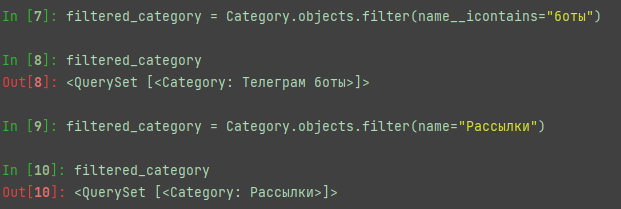
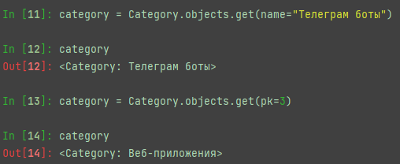
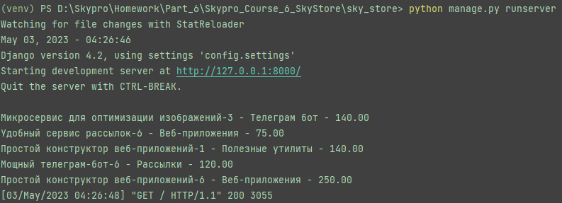

# Shell

### Создание категорий


### Получение списка категорий


### Фильтрация списка категорий



### Получение категории



### Исключение объектов по некоторому условию


### Дополнительное задание

В контроллер отображения главной страницы добавить выборку последних 5 товаров и вывод их в консоль.

```python
from django.http import HttpResponse, HttpRequest
from django.shortcuts import render
from django.views import View

from app_catalog.models import Product


class HomePageView(View):
    def get(self, request: HttpRequest, *args, **kwargs) -> HttpResponse:
        latest_products = Product.get_last_products(count=5)
        for product in latest_products:
            print(product)
        return render(request=request, template_name='app_catalog/home.html')
```


